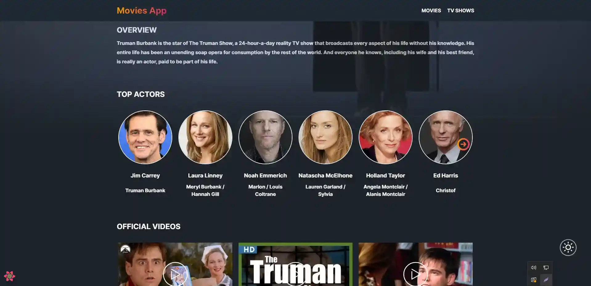

# Getting Started with Create React App

This project [Demo]().

This project was bootstrapped with [Create React App](https://github.com/facebook/create-react-app).

## Available Scripts

In the project directory, you can run:

### `npm start`

Runs the app in the development mode.\
Open [http://localhost:3000](http://localhost:3000) to view it in your browser.

The page will reload when you make changes.\
You may also see any lint errors in the console.

Used api movies [TMDB](https://api.themoviedb.org/3/) - <b>you need to turn on the VPN from Russia.</b>

Used by the library:

    -react-query;
    -@reduxjs/toolkit;
    -react-router-dom;
    -axios;
    -dayjs;
    -framer-motion;
    -react-circular-progressbar;
    -react-infinite-scroll-component;
    -react-lazy-load-image-component;
    -react-player;
    -antd;
    -sass;

### MainPage, options: slider, search movies.

### SearchPage - search movies, options : infinity scroll.

### SingleMoviePage, options: slider.

### ActorPage, options: sort movie.

### DiscoveryPage, options: infinity scroll, sort movies.

